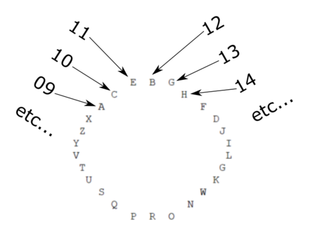

# A Code Camp Story

The clue:  

> (11/14) Portsmouth, Londonderry, and Plymouth  

There are actually 3 clues. You need to visit 3 of the sponsor rooms during the event to acquire them. This is what you will get:  

1. B 12
1. 12 11 02 03 25 11 04 24 16 25 18 23 21 06 24 03 25 24 05 09 19 04 18 23 11
1. W N O R P Q S U T V Y Z X A C E B G H F D J I L G K

The big hint is the challenge title which is a nod to the movie *A Christmas Story*. (Fun fact, this movie is the first one I can clearly remember seeing in a theater.) If you recall, Ralphie eagerly awaits the delivery of his Little Orphan Annie decoder ring. Upon arrival he barricades himself in the bathroom to decode his exclusive secret message.  

This challenge is based on that, but it is corrected as the movie got it wrong....  

Even if you haven't seen the movie (go watch it now) you are supposed to surmise that the letter "B" is represented by the number 12. So, translating the series of numbers you see the first one is "B". If 12 is "B", then what is 11? Well, it is one less than 12 so it is the letter one position to the left of "B" which is "E". Continuing on in this manner and sliding to the other end of the list when you run out of letters, and moving left or right from "B" depending of if the number is less or greater than 12, you get this:  

|code|letter|
|:---|:---|
|12|B|
|11|E|
|02|S|
|03|U|
|25|R|
|11|E|
|04|T|
|24|O|
|16|D|
|25|R|
|18|I|
|23|N|
|21|K|
|06|Y|
|24|O|
|03|U|
|25|R|
|24|O|
|05|V|
|09|A|
|19|L|
|04|T|
|18|I|
|23|N|
|11|E|

It might help to visualize it like a decoder ring that you traverse clockwise or counter-clockwise depending on the relation to the key "B = 12".

The final cruel twist is to figure out the format of the flag. It does not follow the format of most of the other ones, particularly due to the lack of dashes. With some trial and error you come up with:  

**BE SURE TO DRINK YOUR OVALTINE**