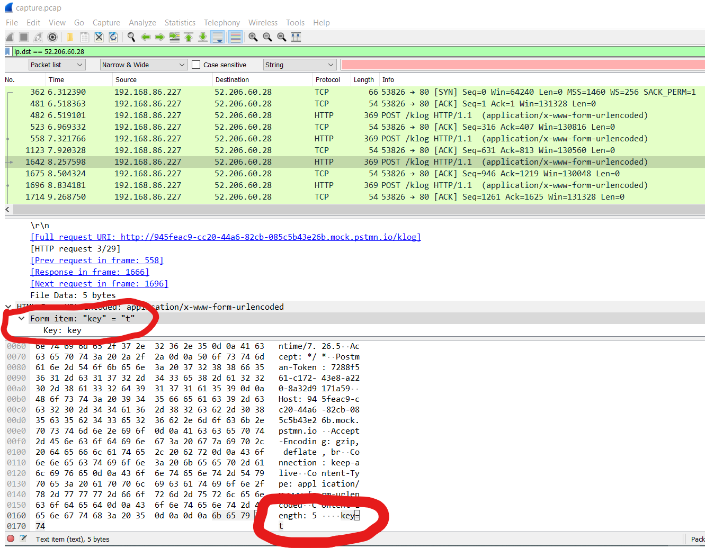

# Following Protocol

The clue:

> I'm sure I don't have a key logger uploading what I type, but... can you just check?

Additionally, there is a link to download a file. This is a pcap, or packet capture file. It was created by running [Wireshark](https://www.wireshark.org/) while a (simulated) keylogger was running. 

The clue specifically mentions "uploading", this was to give you a clue that the traffic you are looking for is probably http traffic. Now, Wireshark is not for the faint of heart. It is not a tool that a typical developer would be using often. But you better believe hackers know how to analyze packets.

As you look at the capture you are probably looking for http traffic. Looking closer you see a bunch of posts to "/klog". Hmmm, does that mean keylogger?

Inspecting it further you can see the post body is "key=x", where x is some letter. If you find all of these captures in the right order you will see: http-is-not-encrypted-traffic

