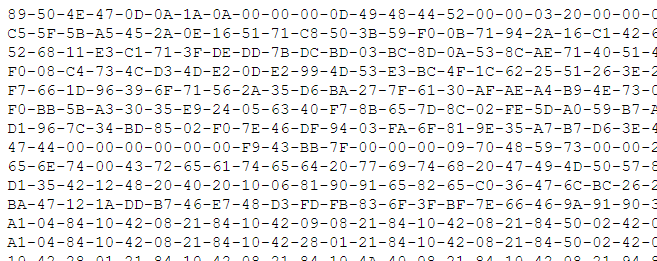

# Image Is Everything

The clue is:

> Dowload the file. Can you find the flag?

Additionally, there is a link that downloads a text file



The intent is for you to recognize the hexidecimal values are probably bytes. If you parse the file to convert the hex to bytes and throw away the dashes, you have the contents of a file. You might try several file formats, but eventually you will try the png image format.

Here is a single c# statement that will convert the text file to a png image. Thanks [@GraniteStHacker](https://twitter.com/GraniteStHacker) for this code:

````
File.WriteAllBytes(@"c:\deleteme\theimage.png", File.ReadAllText(@"C:\deleteme\ImageIsEverything.txt")
	.Split('-')
	.Select(b => byte.Parse(b, NumberStyles.HexNumber, CultureInfo.InvariantCulture))
	.ToArray());
````

