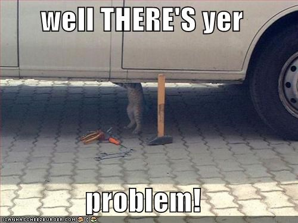
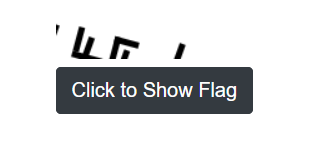
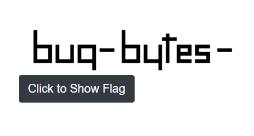
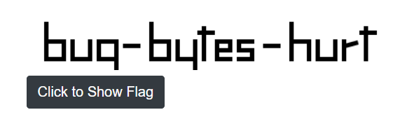

# Just Click It

The clue:

> It couldn't be easier. Just click the button to reveal the flag.

Additionally, there is a link that brings you to a page with a single button that reads "Click to Show Flag". So, all you need to do it click the button... and fix the bugs in the code behind the button.

Just clicking the button shouldn't reveal much, it appears that nothing at all happens. What is the first thing that a web developer does when something on a web page is not behaving normally? Open the browser dev tools and look for errors in the console of course.

> Uncaught TypeError: canvas is null

Next, you should be looking the source code. In FireFox, that is the Debugger tab:
 
  
 
 At this point you should be trying to find the canvas element on the page. Hmmm, there isn't one.  
 
 

  After adding a canvas element on the page, something still ain't right. 
     
    
   
  If you are not familiar with the html canvas, hopefully you are researching it at this point. You notice the code rotates the context a few times. What happens if you remove (most) the rotations?  
     
  getting there, but the flag doesn't work and it looks incomplete ....  
     
    
     
  This is a case of the canvas simply being too small to show the whole flag. Make the canvas wide enough, and tall enough, et voila:  
    
  
   The last rotation is actually needed to place a piece of the "r", though the flag is probably obvious even if that rotation was removed.
