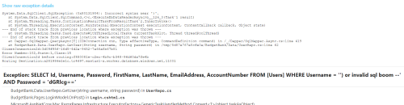
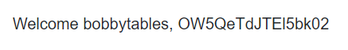

# Lost Password

The clue is:

> Please help little Bobby Tables recover his password

Additionally, there is a link the fictitious Budget Bank website: https://budgetbank.azurewebsites.net/

Like any good hacker, you will try to force an error so that you can see if any sensitive information is revealed. There is not much in the way of input on this site, other than mainupulating cookies, storage, query parameters, etc., you will probably start with the obvious .... the login.

There is a big clue in the challenge description. "Little Bobby Tables" is a referene to the [well known xkcd comic](https://xkcd.com/327/) about the extremely common (yet easily preventable) problem of SQL injection (SQLi) attacks.

With this clue you should be thinking about SQLi and the first thing to try is to force an error to give up database details. So, lets throw something in the username field of the login window that might blow up on purpose. After a some trial and error, you might come up with something like this:

username : `') or invalid sql boom --`  
password: `..anything at all`  

Lo and behold:  

Not only is this site vulnerable to SQLi, but it returns very detailed error messages! Oh man this bad.

 From this response we can infer that the query used to look up a user is:  
 `SELECT Id, Username, Password, FirstName, LastName, EmailAddress, AccountNumber FROM [Users] WHERE Username = ' + username + ') AND Password = '+ password + ''''`

What the hacker has done is inject SQL code into the username and commented out the rest of the query, turning it into invalid SQL that blows up because there is no SQLi mitigation nor prudent error handling.:

SELECT Id, Username, Password, FirstName, LastName, EmailAddress, AccountNumber FROM [Users] WHERE Username = '`') or invalid sql boom --`' AND Password = 'dGRlcg=='

Armed with this information, a carefully crafted username can reveal passwords by using SQL to concatenate the password with the username which is revealed in the user interface. So, appending the password to the username will divulge the password. This query is using `OFFSET` in MS SQL Server to grab data for a single row. In this manner you can enumerate all accounts in the database by changing the `OFFSET`. 

`xxx' union all SELECT Id, Username + ', ' + Password, Password, FirstName, LastName, EmailAddress, AccountNumber FROM Users ORDER BY Id OFFSET 1 ROWS FETCH NEXT 1 ROWS ONLY --`

The site dutifully displays the username, which, thanks to the hacker, is not just the username anymore:

One last twist is to decode that base64 password into "9nPy7ILIynM6", which is the flag.

Let's recap some of the mistakes made by the creators of this site:
1. SQL code is built via string concatenation. Anytime you accept input from an untrusted source (all sources are untrusted) you could be allowing malicious code into your queries. Instead, use prepared statements or well known libraries that prevent SQLi. DO NOT EVER BUILD SQL VIA STRING CONCATENATION EVER NOT EVER NOT EVEN IN TOY APPLICATIONS DON'T DO IT TELL YOUR INSTRUCTORS THEY ARE DOING A DISSERVICE BY TEACHING CONCATENATION SPREAD THE WORD. Even in the year 2020 SQLi remains one of the top vulnerabilities in the wild. It is inexcusable.
1. Errors are not handled. Exceptions blow up the appliction.
1. Full error details are returned to the user. If the SQL statement was not shown in the error message it would have been more work for the hacker to know how to craft a malicious query.
1. More fields than are needed by the page are returned in the result set. 
