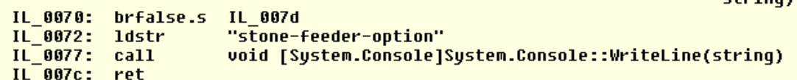

# Environmentally Friendly

The clue... is just a link to a Docker Hub image.

I first tried to run this in Docker for Windows and spent a bunch of time because I thought the Access Denied was a Docker problem.  

I went a little unconventional and found an article that showed how I could access the docker file system from Windows. I found and copied the EnvironmentallyFriendly.dll, then used ILDASM to reverse engineer the code to IL and found the flag.

