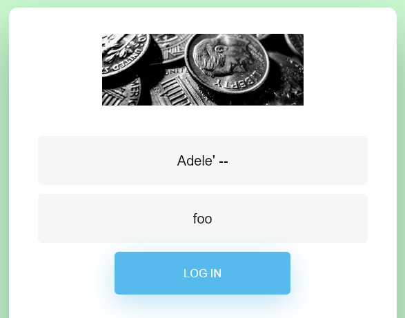
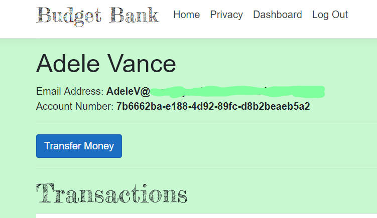

# Something is Phishy

The clue is:

> Send a phishing email to Budget Bank user Adele Vance with subject "capture the flag challenge"

Additionally, there is a link to the ficticious Budget Bank website.

You are told that you need to send an email to one of the Budget Bank users but you are not told what the email address is. So the challenge is to hack the site to obtain the user's email. Once you send the email with that specific subject line, an auto reply will send you the flag.

If you have already done [Lost Password](Lost&#32;Password.md) then you are already in pretty good shape to solve this one because a little SQL Injection (SQLi) will get you logged in as Adele pretty quick.

See [Lost Password](Lost&#32;Password.md) for more detailed explanation of SQLi, here I'm going to come straight out and tell you that you can craft a username to give to the Login screen that will log you in as anyone. You need only enter a correct account name and comment out the rest of the SQL would normally run on the server. You can do some SQLi to figure out the username, but I made it easy to guess: "Adele".

When you enter the following into the Login (password value doesn't matter):
   
  
   
It causes the server to run the following query:
`"SELECT Id, Username, Password, FirstName, LastName, EmailAddress, AccountNumber FROM [Users] WHERE Username = '" + "Adele' --" + "' AND Password = '" + pw "'"`  

Notice how the password part is commented out? The query will succeed and log you in without even knowing a password. By the way, this is a real scenario. Even today there is software that is vulnerable to this attack.  

Once you are logged in, you can see the user's email address. Simply send the phishing email and wait for the flag.  

