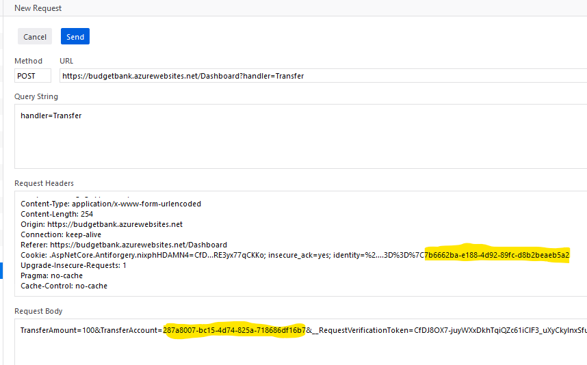
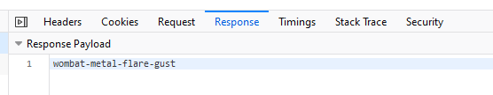

# Transfer Funds

The clue is:

> Transfer money from someone else's account to yours, while signed in as yourself

Thinking like a hacker, you will initiate a valid transfer and look at the network traffic that is generated. The first step to doing that is to hack your way into another account so that you know another account number that you can transfer money to. See [Something is Phishy](Something&#32;is&#32;Phishy.md) for more info on hacking into another account. Once you have another valid account number, you log in as yourself and then initiate a transfer from the "Transfer Money" button. Make sure you are capturing the network traffic with your browser dev tools.  

You will see a POST with similar payload:  

`TransferAmount=100&TransferAccount=7b6662ba-e188-4d92-89fc-d8b2beaeb5a2&__RequestVerificationToken=CfDJ8OX7-juyWXxDkh.....Kps1g2oeaE`  

Using your tool of choice you need only recreate that POST and swap the sender account with the receiver account and the receiver with the sender. In that way you trick the site into initiating a false transfer. This attack works because the identity cookie is not encrypted. It is exposed in plain text and is available for manipulation. Never trust anything coming from the browser! A crafty user can change any aspect of a request.  

Here is the attack done with the FireFox dev tools. I am using the edit and resend feature to modify the request. I have set the recipient of the transfer to my own account in the request body, and the identity of the user to the victim in the cookie:  

  

And the response to that request is the flag:  

